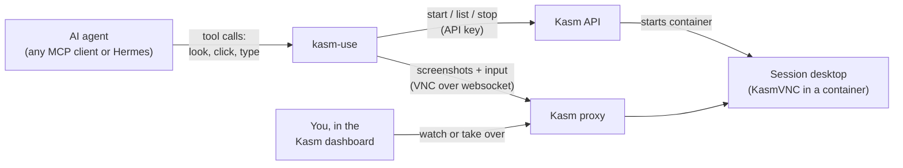

# kasm-use

<!-- mcp-name: io.github.rchurro/kasm-use -->

Let an AI agent use a [Kasm Workspaces](https://kasmweb.com) desktop: start a session, look at the
screen, click, type, press keys, scroll, and stop it — in plain language, from any MCP client
(Claude Code, Claude Desktop, OpenCode, Cursor, …) or as a native [Hermes Agent](#hermes-agent) plugin.

Other Kasm MCP servers manage sessions (start, list, stop). **kasm-use actually uses them**: the agent
sees the desktop and operates it, like computer-use or browser-use, inside your Kasm.

- **Works with stock Kasm images.** Nothing is baked into the workspace; it drives the desktop
  through Kasm's API and the session's own KasmVNC connection.
- **You can watch and take over.** Sessions are created as *your* Kasm user, so they show up in
  your Kasm dashboard. Open one to watch the agent work, or to handle a login or CAPTCHA yourself.
- **Your Kasm, your key.** You run the server next to your own Kasm. Nothing goes through a third party.

### What's Kasm?

[Kasm Workspaces](https://kasmweb.com) streams disposable desktops and apps to your web browser,
each running in its own container on a server you control. Click "Chrome" and you get a fresh
Chrome in a browser tab; close it and it's wiped. kasm-use lets an AI agent sit down at those
desktops and use them the way a person would.


*Demo (3x speed): Hermes Agent runs a three-session demo with kasm-use. Chrome, Terminal and
Minetest are started and driven in parallel while the Kasm dashboard shows each one live.*

How the pieces connect:



## Status: early — testers wanted

kasm-use works well on the setup it was built on (Kasm 1.19.0 in linuxserver's Docker image;
Chrome, Terminal and Minetest workspaces; Claude Code and Hermes Agent as clients). It talks to
parts of Kasm that aren't documented, so other versions and install types are the big unknown.
If you try it, please [open an issue](https://github.com/rchurro/kasm-use/issues/new/choose),
whether it worked or not: your Kasm version, how Kasm is installed, the workspace image and your
MCP client are the most useful details.

## Tools

| Tool | What it does |
| --- | --- |
| `kasm_list` | Workspaces you can start, and your running sessions |
| `kasm_start` | Start a workspace (e.g. `Chrome`); returns once the session is running |
| `kasm_look` | Live screenshot of the session, returned as an image (~1 s) |
| `kasm_click` | Click at x,y in the latest screenshot's coordinates |
| `kasm_type` | Type text into the focused field |
| `kasm_key` | Keys/shortcuts, e.g. `ctrl+l`, `Return`, `Tab` |
| `kasm_scroll` | Scroll, optionally at a point |
| `kasm_stop` | Destroy the session |

## Requirements

- Kasm Workspaces **1.19 or newer** (tested on 1.19.0).
- A Kasm **API key**: Admin → Settings → Developers → API Keys → Add, then edit its permissions.
  kasm-use 0.3 needs exactly these five (tested end to end with a key that has only these):

  - **Images View**, **User**, **Users Auth Session** — starting sessions (without them `kasm_start`
    fails with `Unauthorized`).
  - **Sessions View** — session status and `kasm_list`.
  - **Sessions Delete** — `kasm_stop`.

  It no longer calls Kasm's exec API (**Sessions Modify**) or screenshot API (**Session Recordings
  View**), so you can remove those if you granted them for 0.2 or earlier. A missing permission shows
  up as `Unauthorized` from the tool that needs it. Read [Security model](#security-model) first:
  these permissions are server-wide.
- Your Kasm **user ID**, so sessions belong to you: Admin → Access Management → Users → open your user;
  the ID is in the page URL.
- Any workspace image. Nothing is installed in the session for sessions kasm-use starts.

## Configuration

| Variable | Required | Meaning |
| --- | --- | --- |
| `KASM_API_URL` | yes | e.g. `https://kasm.example.com` |
| `KASM_API_KEY` / `KASM_API_KEY_SECRET` | yes | the API key pair |
| `KASM_USER_ID` | yes | the Kasm user sessions are created for |
| `KASM_VERIFY_TLS` | no | `false` to accept a self-signed Kasm certificate (default `true`) |
| `KASM_USE_TOKEN` | HTTP only | bearer token clients must send |

## Run it

### Locally (stdio) — the usual way

Your MCP client starts the server itself. With [uv](https://docs.astral.sh/uv/) installed:

```json
{
  "mcpServers": {
    "kasm": {
      "command": "uvx",
      "args": ["kasm-use"],
      "env": {
        "KASM_API_URL": "https://kasm.example.com",
        "KASM_API_KEY": "…",
        "KASM_API_KEY_SECRET": "…",
        "KASM_USER_ID": "…"
      }
    }
  }
}
```

Claude Code:

```bash
claude mcp add kasm -e KASM_API_URL=https://kasm.example.com -e KASM_API_KEY=… -e KASM_API_KEY_SECRET=… -e KASM_USER_ID=… -- uvx kasm-use
```

### As a service (streamable HTTP)

```bash
docker run -d -p 8000:8000 \
  -e KASM_API_URL=https://kasm.example.com -e KASM_API_KEY=… -e KASM_API_KEY_SECRET=… \
  -e KASM_USER_ID=… -e KASM_USE_TOKEN="$(openssl rand -hex 32)" \
  ghcr.io/rchurro/kasm-use:latest
```

Clients connect to `http://host:8000/mcp` with the header `Authorization: Bearer <KASM_USE_TOKEN>`.
Health check: `GET /healthz`. Run **one replica** per Kasm user: the server remembers each
session's last screenshot size in memory to map click coordinates.

Keep it on a private network (LAN, VPN, Tailscale). Anyone with the token can drive your desktops.

### Hermes Agent

```bash
pip install kasm-use                      # into Hermes's Python environment
cp -r hermes-plugin/kasm ~/.hermes/plugins/kasm
```

Enable `kasm` under `plugins.enabled`, set the environment variables above, and start a new
Hermes session (`/new`) so the tools load.

## Safety

An agent with these tools drives a real desktop on your network, so treat it like handing someone
your mouse and keyboard.

- **Use throwaway workspaces.** Don't let the agent work in a session that's logged into your
  real accounts, and don't save passwords in workspace images it uses.
- **Web pages can talk to the agent.** Text on a page it visits can try to steer it (prompt
  injection). Keep a human watching for anything that matters.
- **Traffic comes from your network.** Whatever the agent browses comes from your Kasm host's IP
  address. Kasm's per-workspace VPN/egress settings can route it elsewhere.
- The tool descriptions tell the agent never to type passwords, MFA codes or payment details and
  to hand CAPTCHAs to you, but that is guidance to the model, not enforcement.

## Security model

Two Kasm facts shape what kasm-use can and can't promise:

- **A Kasm API key is server-wide, not per user.** Kasm has no way to limit a key to one user.
  With the permissions above it can see and stop any user's sessions, and **Users Auth Session**
  ("login on behalf of another user") lets it get a login for any user.
- **The token `request_kasm` returns is a login for `KASM_USER_ID`, not for one session.** It opens
  every session that user has (verified on Kasm 1.19.0: a token from one session opened another
  session of the same user over VNC).

So the boundary is kasm-use itself:

- **Every tool only acts on sessions this kasm-use process started.** Any other `session_id` (yours,
  another user's, one from before a restart) is refused, including for `kasm_look` and `kasm_stop`.
  `kasm_list` only shows kasm-use's own sessions.
- **The model never sees the API key or any token**, only the eight tools.
- **No exec, no screenshot API.** kasm-use doesn't use Kasm's exec API (which can run commands in a
  session as root) or its screenshot API, so it doesn't need those permissions.

What that means for you:

- **Treat the API key like an admin credential**, and run kasm-use only on a machine you trust.
  Anyone who gets the key gets your Kasm, whatever kasm-use's code does.
- **Give the agent its own Kasm user** and set `KASM_USER_ID` to it. That keeps the agent's sessions
  and tokens away from your own sessions if something goes wrong in kasm-use. (It is a seatbelt,
  not a wall: the key itself can still reach every user.)
- **Kasm's disposability helps, but only so much.** Sessions are thrown away when they end (unless
  you enable persistent profiles), so nothing an agent does survives the session. The exposure is in
  sessions that are still running: one that's logged into an account, or that you're working in.
- **There's no per-action policy yet** (rate limits, blocked keys, "ask the human first"). Input goes
  straight to VNC once the scope check passes. VNC only sees pixels and keystrokes, so rules like
  "never type into this window" can't be enforced at this layer.

## Limitations

- **Only sessions kasm-use started, and only until it restarts.** The session tokens live in
  memory. After a restart, earlier sessions keep running in Kasm but kasm-use won't touch them;
  stop them from the Kasm dashboard.
- **Input reports "sent", not "succeeded".** The next screenshot is the confirmation.
- **CAPTCHAs, passwords, MFA and payments are handed to you.** The tool descriptions tell the agent
  never to type them; open the session in Kasm and take over.
- It's slow compared to a local browser tool: every step is a screenshot round trip.

## How it works

kasm-use talks to each session's KasmVNC server directly, through Kasm's own proxy
(`wss://<kasm>/desktop/<id>/vnc/websockify`), with the login token `request_kasm` returns.
The VNC client is built in and uses only the Python standard library.

- **Eyes:** a full framebuffer read over VNC (ZRLE, decoded with `zlib`), returned as PNG.
  Kasm's screenshot API isn't used for these sessions: it only refreshes while a viewer is
  connected, so with nobody watching it returns stale frames.
- **Hands:** VNC pointer and key events. KasmVNC's pointer message is 11 bytes (16-bit button
  mask plus scroll deltas), not standard RFB's 6.
- Clicks are given in screenshot pixels and scaled to the desktop's current size, which VNC reports
  on connect — it changes when someone opens the session and Kasm resizes it to their window.
- Each tool call opens a short VNC connection and does a round trip before closing, so no input
  is lost on disconnect. The owner can stay connected at the same time.

**What this relies on.** None of this is an official Kasm API; it's how Kasm's own web viewer
connects, observed on Kasm 1.19.0:

- Kasm's proxy accepts the `username` + `session_token` cookies that `request_kasm` returns, and
  requires an `Origin` header matching the Kasm host.
- Behind the proxy, KasmVNC offers VNC authentication and accepts an empty password (the proxy
  has already authenticated you).
- KasmVNC's pointer message is 11 bytes (visible in its open-source web client).

A Kasm update or a different install type could change any of these. If kasm-use stops
connecting, that's the likely cause, and an issue with your Kasm version and install type helps.

## License

MIT
